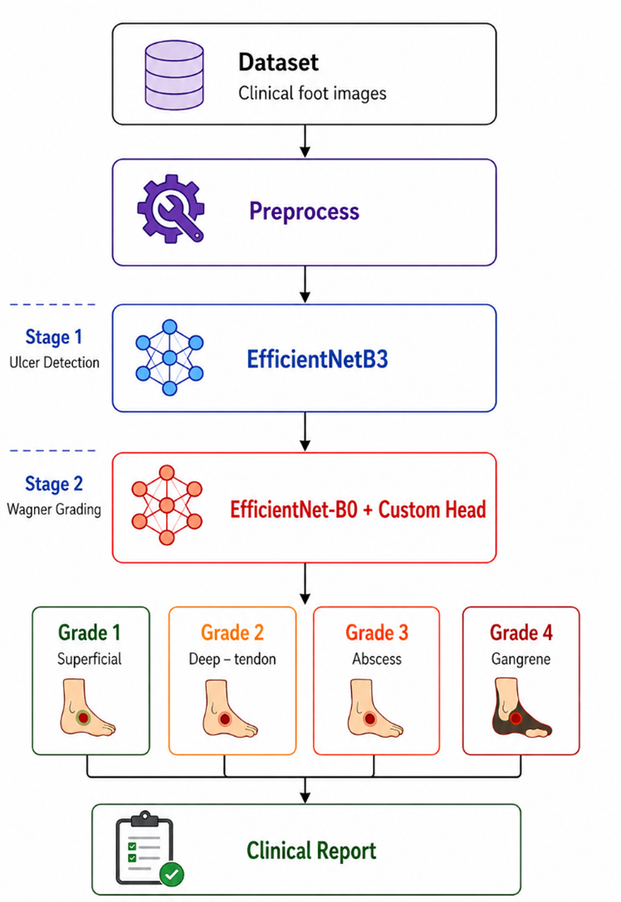
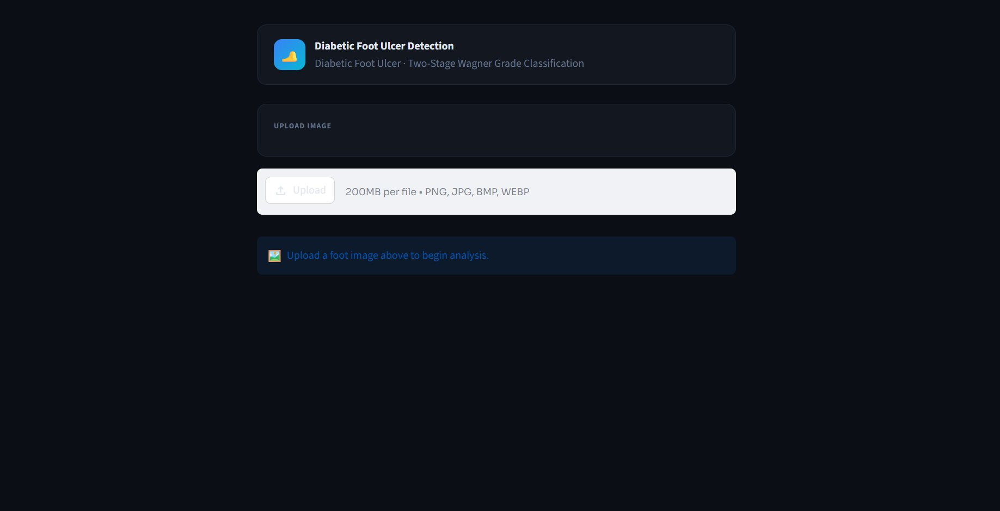
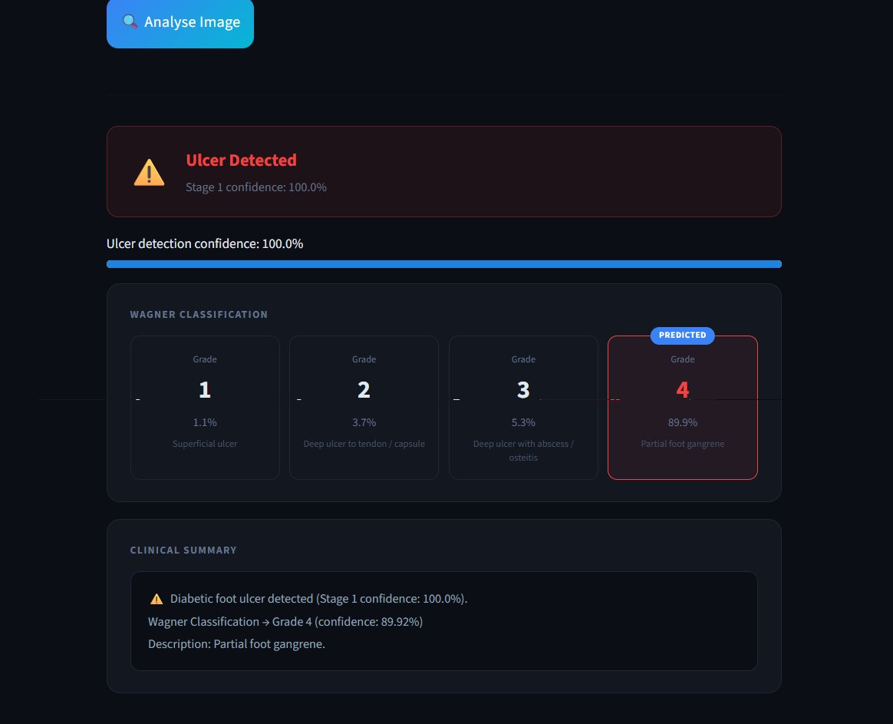

# DFU_using_DL

A deep learning based tool for Diabetic Foot Ulcer detection and severity grading, built as part of my final year project. It uses a two-stage AI pipeline — first checking if an ulcer is present, then grading its severity using the Wagner classification system.

---

## What it does

Diabetic foot ulcers are one of the leading causes of amputation in diabetic patients, and early detection really matters. I built this to make the analysis process faster and more accessible.

**Stage 1** — Takes a foot image and detects whether an ulcer is present using a TensorFlow EfficientNet model.

**Stage 2** — If an ulcer is detected, a PyTorch EfficientNet model classifies it into Wagner grades (0–5), which is a standard clinical severity scale.

The whole thing runs in a Streamlit web app, so anyone can upload an image and get a result without needing to know anything about ML.

---

## Pipeline overview

```
Input Image
     ↓
Stage 1: Ulcer Detection (model_1.h5)
     ↓
Ulcer detected?
    ↙        ↘
  No          Yes
   ↓            ↓
 "No ulcer"   Stage 2: Wagner Grading (model_2.pth)
                ↓
          Grade + Confidence + Clinical Summary

```
**Architecture**

---

## Project structure

```
DFU_using_DL/
│
├── app/
│   └── streamlit_app.py        # Streamlit UI
│
├── models/
│   ├── model_1.h5            # Stage 1: TensorFlow detection model
│   └── model_2.pth # Stage 2: PyTorch grading model
│
├── src/
│   └── model_integration.py    # Two-stage pipeline logic
│
├── assets/
│   ├── homepage.png
│   ├── prediction.png
│   └── architecture.png
│
├── requirements.txt
├── README.md
├── .gitignore
```

---

## Setup

**1. Clone the repo**
```bash
git clone https://github.com/yourusername/DFU-Analyzer.git
cd DFU-Analyzer
```

**2. Install dependencies**
```bash
pip install -r requirements.txt
```

**3. Run the app**
```bash
streamlit run app/streamlit_app.py
```

> Make sure both model files are inside the `models/` folder before running.

---

## Usage

1. Open the app in your browser (Streamlit will give you a local URL)
2. Upload a foot image
3. Click **Analyse Image**
4. The app will show you:
   - Whether an ulcer was detected
   - Wagner grade (if ulcer found)
   - Confidence score
   - A brief clinical summary

---

## Tech stack

| Layer | Tools |
|---|---|
| Frontend | Streamlit |
| Stage 1 Model | TensorFlow, EfficientNet (.h5) |
| Stage 2 Model | PyTorch, EfficientNet, timm (.pth) |
| Image Processing | OpenCV, Pillow, albumentations |
| Utilities | NumPy, scikit-learn |

---

## Models

**Stage 1 — Ulcer Detection**
- Framework: TensorFlow / Keras
- Architecture: EfficientNet
- Output: Binary (ulcer / no ulcer)

**Stage 2 — Wagner Grading**
- Framework: PyTorch
- Architecture: EfficientNet (via `timm`)
- Output: Wagner grade 0–4 with confidence score

---

## Wagner Grading Scale

| Grade | Description |
|---|---|
| 0 | No open lesion, may have deformity |
| 1 | Superficial ulcer, no infection |
| 2 | Deep ulcer, may reach tendon/capsule |
| 3 | Deep ulcer with abscess or osteomyelitis |
| 4 | Partial foot gangrene |

---

## What we would add with more time

- REST API using Flask so it can be used outside of Streamlit
- Batch image processing
- Cloud deployment (probably Render or HuggingFace Spaces)
- Export predictions as a PDF report
- Database to track patient history over time

---

## Screenshots

**Homepage**


**Prediction Result**


---

## Team

**Varun Kumar**  
B.Tech CSE — Chandigarh Group of Colleges, Landran

**Shubham**  
B.Tech CSE — Chandigarh Group of Colleges, Landran

**Tanisha Sharma**  
B.Tech CSE — Chandigarh Group of Colleges, Landran
